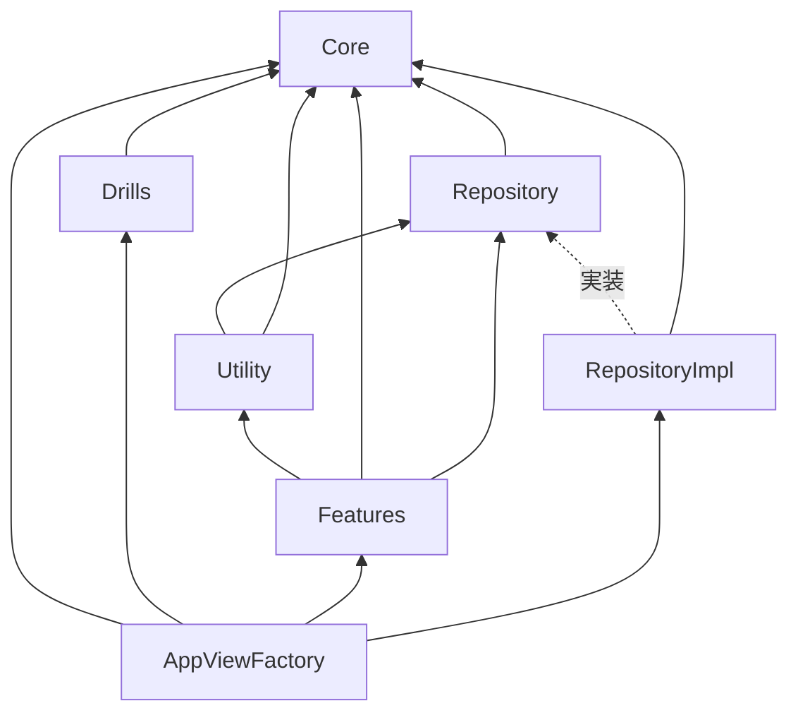

# Tap Drill For Kids

## 概要
このアプリは幼児向けの学習アプリです。
音声を聞いて該当のパネルをタップするシンプルなルールです。
選択肢の数、時間制限、失敗した時のペナルティの組み合わせで複数の難易度を用意しています。

## 設計方針
- 基本的にSwiftUIのみ
- 設計パターンは現状はMVVM中心
  - ViewModelのテストで仕様を網羅することを実験的に進めている。
    - 遷移の状態もViewModelで管理
      - 遷移における副作用を差し込みできる状態
      - 画面遷移するシナリオをテストできない
    - メリット: 画面仕様へのキャッチアップをテストで確認できると
    - デメリット: SwiftUIならではなおViewのみでできることをわざわざViewModelを通さないといけない
  - 1画面 : 1ViewModel
    - 子ビューを分けて作る場合に子ViewModelを作らず。アクションは全てクロージャで渡す。
    - Bindingは使っていい方針だが、現状全てletで事足りている
  - ViewModelを必要としないシンプルな画面（≒100行程度に収まるView）は直接Utility, UseCase, Repositoryに依存するのはOK
    - ViewModelがあるのにViewがUtility, UseCaseに依存するのはNG
  - Modelというレイヤーは存在せず、CoreとUseCaseに依存する形で実装
    詳しくは下記の各レイヤー詳細で説明
  - いずれTCAに置き換えることも想定
- SwiftPMを使ったマルチモジュール構成
  - Xcode cloudと相性が悪い（CI上でビルドできない）のでxcodeprojを複数扱える構成にはしていない
  - マニフェストファイル(Package.swift)でモジュールの依存関係を制御して強制DIPを実現
- CI/CD: Xcode cloud
  - swift package pluginを使っているのでci_scriptsを用意
  - Workflows
    - mainブランチ向けのPullRequestの更新
      - ビルド、テスト
    - Tagの更新
      - テスト、アーカイブ（TestFlight）

### 依存図

### Core
- ビジネスロジックやデータ構造
- 他のモジュールに依存しない ※拡張機能(Extensions)を除く

### Drills
- Coreの実装
- Coreに依存

### Repository
- 機能、画面、モジュールをまたぐパブリックなデータを取り扱うインターフェース
- Coreにのみ依存
- CRUDベースで極力シンプルなインターフェース設計にする

### RepositoryImpl
- Repositoryの実装
- DataClientの隠蔽
  - RepositoryImplモジュール内のinternalスコープで実装
  - データへのアクセスをRepositoryからのみに制限

### Utility
- 主に副次効果など画面単位のシナリオに依存しないドメインロジックを取り扱う
- 現在はSoundEffectのみだがViewModelのテストがやりにくいのでTimerもインターフェースから設計してここで扱うようにしたいと思いっている。

### Features
- 画面単位
- 各画面に必要なレイヤーを内包
- 設計パターン
  - View(実装のみ)
    - 責務: 表示, レイアウト, 遷移
  - ViewModel(Protocol, Impl)
    - 責務: 画面の状態, 状態の変更, Viewからのアクションをハンドリング 
    - 画面の仕様を極力テストで網羅
      → 仕様へのキャッチアップとリグレッションテストを兼ねる
  - UseCase(Protocol, Interactor)
    - 責務: 画面の状態に依存しないドメインロジック全般
  - ViewFactory(Protocol)
    - 責務: DIとそれによって生成したViewをAnyViewとして返す
    - Routerという命名にしないのは遷移を責務とせず、Viewからすると「材料を渡すと欲しいViewを作ってくれる」というインターフェースにする方がシンプルと考えたたため。
    - ViewFactoryProtocolが他のFeatureに依存しない（つまりFeatureが他のFeatureに依存しない）ようにするため一律AnyViewを返す仕様にしている。
    - 遷移のためにAnyViewを使う程度だとパフォーマンスには影響はなさそう。
- Core, Utility, Repositoryに依存
- 各実装への依存禁止
- Feature同士の依存禁止

### AppViewFactory
- AppViewFactory
  - アプリ起動時、最初に表示する画面を生成
- InternalViewFactory
  - 各FeatureのViewFactoryの実装
- 全てに依存してOK
