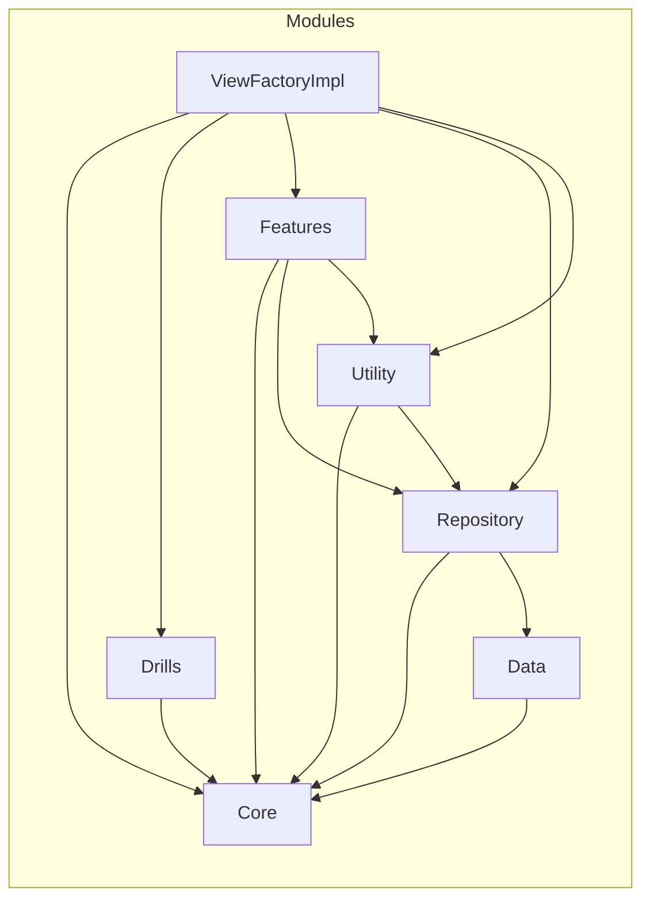

# Tap Drill For Kids

## 概要
### アプリについて
このアプリは幼児向けの学習アプリです。
音声を聞いて該当のパネルをタップするシンプルなルールです。
選択肢の数、時間制限、失敗した時のペナルティの組み合わせで複数の難易度を用意しています。

### リポジトリについて
現状、機密情報の取り扱い等がないため公開していますが、今後のバージョンアップにおいて非公開にする可能性があります。

## 設計方針
- 基本的にSwiftUIのみ
- 設計パターンは現状はMVVM中心
  - ViewModelのテストで仕様を網羅することを実験的に進めている。
    - 遷移の状態や遷移のActionもViewModelで管理
      - 遷移における副作用が必要になったときにめんどくさいので
      - 画面遷移するシナリオをテストできない
    - 画面仕様へのキャッチアップをテストで確認できるメリットと網羅するために起きるめんどくささ等のデメリットを比較したいのが目的
  - 1画面 : 1ViewModel
    - 子ビューを分けて作る場合に子ViewModelを作らず。アクションは全てクロージャで渡す。
    - Bindingは使っていい方針だが、現状全てletで事足りている
  - ViewModelを必要としないシンプルな画面（≒100行程度に収まるView）は直接Utility, UseCaseに依存するのはOK
    - ViewModelがあるのにViewがUtility, UseCaseのがNG
  - Modelというレイヤーは存在せず、CoreとUseCaseに依存する形で実装
    詳しくは下記の各レイヤー詳細で説明
  - いずれTCAに置き換えることも想定
- マルチモジュールによる依存関係の制限でクリーンな設計を保つ

### 依存図

### Core
- ビジネスロジックやデータ構造
- 他のモジュールに依存しない ※拡張機能(Extensions)を除く

### Drills
- Coreの実装
- Coreに依存

### Data
- データストレージのクライアント
- Coreに依存
- Repositoryからの依存のみを想定

### Repository
- 機能、画面、モジュールをまたぐパブリックなデータを取り扱うインターフェース
- Data, Coreに依存
- CRUDベースで極力シンプルなインターフェース設計にする

### Utility
- 主に副作用を取り扱うUseCase
- 現在はSoundEffectのみだがViewModelのテストがやりにくいのでTimerもインターフェースから設計してここで扱うようにしたいと思いっている。

### Features
- 画面単位
- 各画面に必要なレイヤーを内包
- 設計パターン
  - View(実装のみ)
    - 責務: 表示, レイアウト, 遷移
  - ViewModel(Protocol, Impl)
    - 責務: 画面の状態, 状態の変更, Viewからのアクションをハンドリング 
    - 画面の仕様を極力テストで網羅
      → 仕様へのキャッチアップとリグレッションテストを兼ねる
  - UseCase(Protocol, Interactor)
    - 責務: 画面の状態に依存しないドメインロジック全般
  - ViewFactory(Protocol)
    - 責務: DIとそれによって生成したViewをAnyViewとして返す
    - Routerという命名にしないのは遷移を責務とせず、Viewからすると「材料を渡すと欲しいViewを作ってくれる」というインターフェースにする方がシンプルと考えたたため。
    - ViewFactoryProtocolが他のFeatureに依存しない（つまりFeatureが他のFeatureに依存しない）ようにするため一律AnyViewを返すことを責務としている。
    - 遷移のためにAnyViewを使う程度だとパフォーマンスには影響はなさそう。
- Core, Utility, Repositoryに依存
- 各実装への依存は禁止

### ViewFactoryImpl
- 本番実装のための画面生成とDIを責務
- 全てに依存してOK
- だったらモジュールにせずAppと同じ場所に置く方がいい気もしている
- 命名など詳細は上記Features/設計パターン/ViewFactoryを参照
